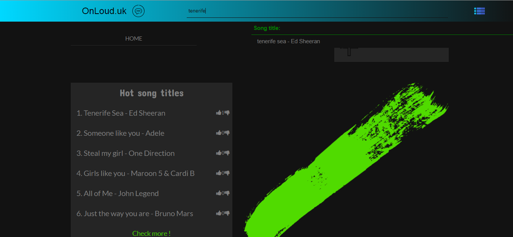
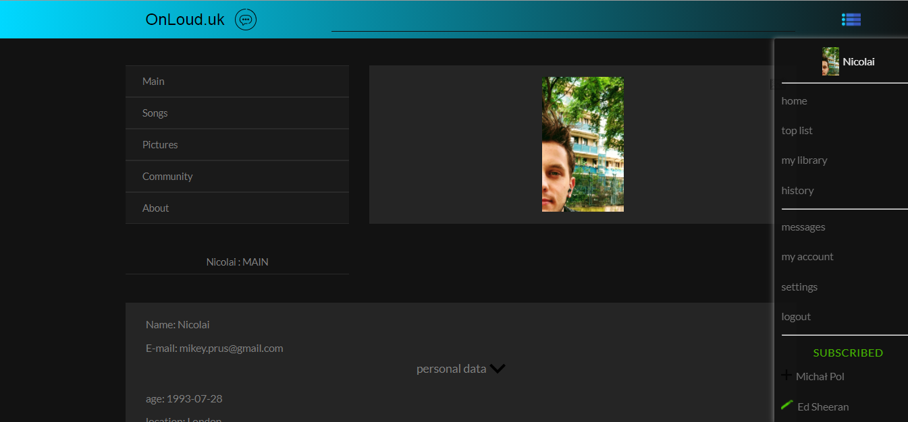
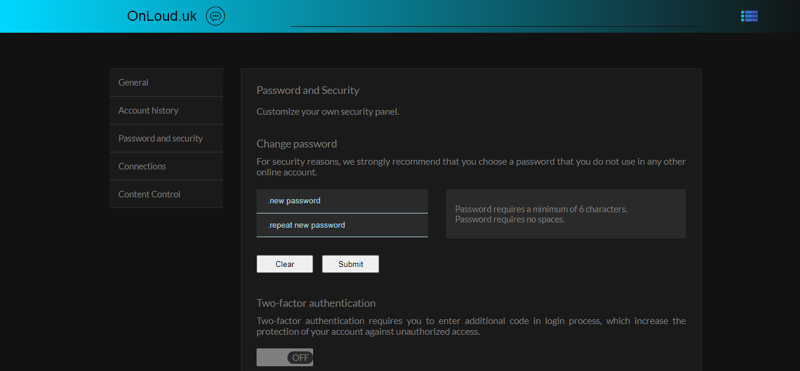

# onloud.herokuapp.com

> Full-stack application which is a music and lyric website. Provides contact and entertaiment.

Application stack of technologies:
* React, redux, node, express
* MongoDB
* Heroku, AWS Amazon s3
* Sendgrid email service


## Usage
Rename "config/config.env.env" to "config/config.env" and update environment settings to your own.

## Install dependencies
```
npm install
```
Run App
```
# Run in dev mode
npm run dev

# Run in production mode
npm start
```

- Version 1.0.0
- Licence BSD

created by mikey.prus@gmail.com

---

### Screen 411 x 731 - Pixel 2 device


---

### Screen 1366 x 768 - Laptop device

* user home page with the search bar


* user profile


* password and security
